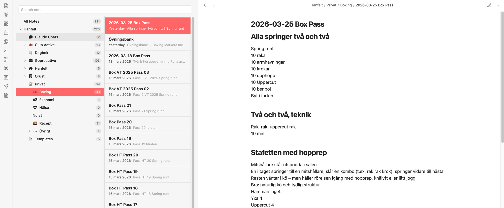

# Notes List

An Obsidian plugin that adds an Apple Notes-inspired sidebar with a two-column layout: folders on the left, notes on the right.



## Features

- **Folder tree** with expandable subfolders and file counts
- **Note list** with title, relative date, and content preview snippet
- **Search** to filter notes by name
- **Resizable columns** - drag the divider to adjust widths (persisted between sessions)
- **Right-click context menus** on both folders and files, with full Obsidian `file-menu` integration (other plugins can add their items)
- **Inline creation** - create new folders and notes directly in the sidebar with an input field
- **Icon support** - displays icons from the [Obsidian Icon Folder](https://github.com/FlorianWoworle/obsidian-icon-folder) plugin (emoji, Font Awesome, Remix Icons)
- **Persistent state** - remembers expanded folders, selected folder, and column width across restarts

## Installation

### Manual

1. Download `main.js`, `manifest.json`, and `styles.css` from the [latest release](https://github.com/hanfelt/obsidian-notes-list-plugin/releases)
2. Create a folder `notes-list` in your vault's `.obsidian/plugins/` directory
3. Place the downloaded files in that folder
4. Restart Obsidian and enable **Notes List** under Settings > Community plugins

### Build from source

```bash
git clone https://github.com/hanfelt/obsidian-notes-list-plugin.git
cd obsidian-notes-list-plugin
npm install
npm run build
```

Then copy `main.js`, `manifest.json`, and `styles.css` to your vault's `.obsidian/plugins/notes-list/` directory.

## Usage

The plugin adds a **Notes** tab to the left sidebar. You can also open it via:

- The ribbon icon (file icon)
- Command palette: **Open Notes List**

### Folder panel (left)

- Click a folder to filter the note list
- Click the chevron to expand/collapse subfolders
- Right-click for context menu (new note, new subfolder, rename, etc.)
- **All Notes** at the top shows every note in the vault

### Note panel (right)

- Notes are sorted by last modified
- Each note shows title, date, and a preview snippet
- Click to open, right-click for context menu
- Works with all Obsidian file-menu plugins

## License

MIT
